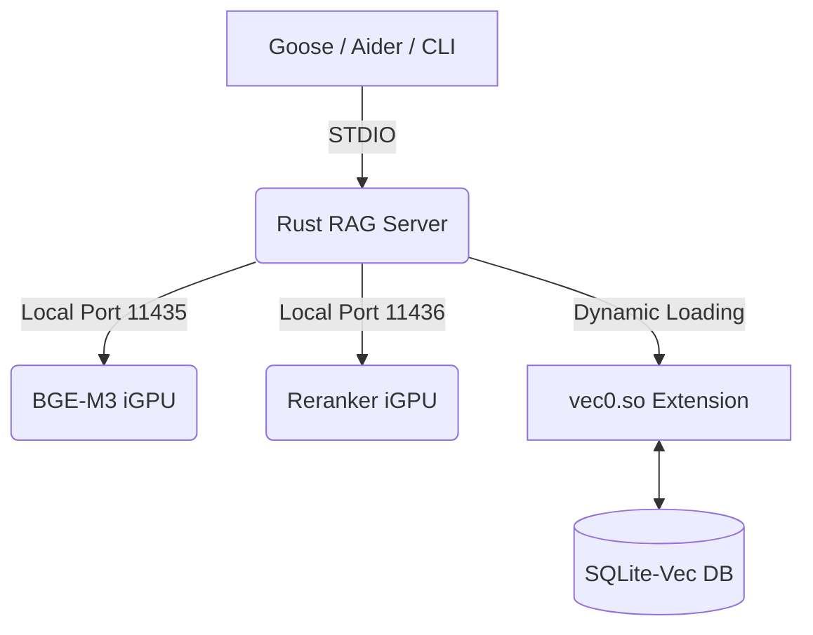

# 🚀 Sovereign RAG MCP Server (Rust)

> **High-Performance Legal & Code Intelligence for the Terminal.**

A "Native & Lean" implementation of a Retrieval-Augmented Generation (RAG) server written in **Rust**. This server exposes high-precision search logic via the **Model Context Protocol (MCP)**, specifically optimized for **Fedora 44** and **Intel iGPU (Vulkan)** hardware.

By bypassing the "PCIe dinosaur" and utilizing **Unified Memory Architecture (UMA)**, this server provides the lightning-fast "memory" required for autonomous agents like **Goose** and **Aider**.

---

## ✨ Key Milestones in v2.2 (The "Sovereign" Update)

- **Exact BGE-M3 Tokenization:** Integrated the Hugging Face `tokenizers` crate. Unlike simple word-counters, this ensures 1:1 parity with the **XLM-RoBERTa** BPE standard used by BGE-M3.
- **Vulkan-Driven Vector Search:** Powered by `sqlite-vec` (v0.1.9+) utilizing the `vec0.so` extension for high-density ANN search directly on the iGPU.
- **Zero-Latency In-Process Processing:** Tokenization and chunking happen in-process at C-speeds, eliminating the overhead of Python-based middleware.
- **Dual-Engine Architecture:** Optimized to communicate directly with dedicated backend pipelines:
  - **Port 11435:** BGE-M3 Multilingual Embeddings.
  - **Port 11436:** BGE-Reranker-v2-M3 for 97% citation accuracy.
- **Consolidated Sovereignty:** Self-contained environment. All code, databases, and metadata are stored strictly at `~/.config/rag-server/`.
- **Full CLI with `--help`:** The server now doubles as a powerful command-line tool. All tools are accessible as subcommands with built-in help and argument parsing via `clap`.

---

## 🏗 Architecture: The Zero-Proxy Stack

The server communicates directly with local Vulkan-accelerated engines over native STDIO pipes, ensuring 0% data leakage and minimum latency.



---

## 🔧 Installation & Compilation

### 1. Prerequisites

Ensure you have the Rust toolchain and the specialized `vec0` extension for SQLite.

```bash
# Install system dependencies
sudo dnf install -y sqlite-devel poppler-utils

# Download the specific vec0.so (v0.1.9+)
mkdir -p ~/.config/rag-server/extensions
cd /tmp
curl -L -O https://github.com/asg017/sqlite-vec/releases/download/v0.1.9/sqlite-vec-0.1.9-loadable-linux-x86_64.tar.gz
tar -xvf sqlite-vec-0.1.9-loadable-linux-x86_64.tar.gz
mv vec0.so ~/.config/rag-server/extensions/
```

### 2. Tokenizer Setup

Download the BGE-M3 metadata required for exact tokenization.

```bash
wget https://huggingface.co/BAAI/bge-m3/resolve/main/tokenizer.json -O ~/.config/rag-server/tokenizer.json
```

### 3. Build the Binary

```bash
cd ~/.config/rag-server
cargo build --release
```

---

## ⚙️ Configuration

The server defaults to optimized values for a 16GB U-series workstation but can be overridden via environment variables in your `~/.zshrc`.

| Variable                   | Default Value                             | Description                             |
| :------------------------- | :---------------------------------------- | :-------------------------------------- |
| `SQLITE_VEC_PATH`          | `~/.config/rag-server/extensions/vec0.so` | Path to the vector extension.           |
| `RAG_DB_PATH`              | `~/.config/rag-server/vectors.db`         | Path to the local Knowledge Base.       |
| `RAG_TOKENIZER_PATH`       | `~/.config/rag-server/tokenizer.json`     | BGE-M3 BPE dictionary.                  |
| `RAG_EMBED_URL`            | `http://localhost:11435/v1/embeddings`    | Vulkan Embedding server.                |
| `RAG_RERANK_URL`           | `http://localhost:11436/rerank`           | Vulkan Reranker server.                 |
| `RAG_CHUNK_SIZE`           | `1024` (Legal) / `3000` (Code)            | Max tokens per segment.                 |
| `RAG_CHUNK_OVERLAP`        | `150` (Legal) / `400` (Code)              | Token overlap for context.              |
| `RAG_EMBED_MODEL`          | `bge-m3`                                  | Model name sent to the embedder.        |
| `RAG_RERANK_MODEL`         | `bge-reranker-v2-m3`                      | Model name sent to the reranker.        |
| `RAG_RERANK_MIN_SCORE`     | `0.3`                                     | Minimum relevance score to keep.        |
| `RAG_MAX_CONCURRENT_FILES` | `4`                                       | Parallelism when ingesting directories. |

---

## 🔌 Usage with Goose Agent

Integrate the server as a **stdio** extension in `~/.config/goose/config.yaml`:

```yaml
extensions:
  rag:
    enabled: true
    name: rag
    type: stdio
    cmd: /home/bfrost/.config/rag-server/target/release/rag-server
    env:
      SQLITE_VEC_PATH: /home/bfrost/.config/rag-server/extensions/vec0.so
    timeout: 7200
```

---

## 🛠 MCP Tools (available to Goose)

- `create_collection` – Initializes a new KB (e.g., `juridik` or `rust-src`).
- `ingest_file` – Chunks, tokenizes, and indexes a file via the iGPU.
- `ingest_directory` – Bulk‑ingests all matching files in a directory with parallel processing.
- `add_documents` – Indexes raw text strings directly from JSON.
- `query` – Performs hybrid semantic search + reranking for **97% citation accuracy**.
- `list_collections` – Displays all local libraries and document counts.
- `delete_documents` – Deletes one or more documents from a collection.
- `delete_collection` – Removes an entire collection and all its data.

---

## 🖥 CLI Usage (New in v2.2)

The same binary now also acts as a full‑featured command‑line tool. Run it without arguments to start the MCP server (stdin/stdout). Run it with a subcommand to perform operations directly.

### Global help

```bash
./target/release/rag-server --help
```

### Subcommand help

```bash
./target/release/rag-server create-collection --help
./target/release/rag-server ingest-file --help
./target/release/rag-server ingest-directory --help
./target/release/rag-server add-documents --help
./target/release/rag-server query --help
./target/release/rag-server list-collections --help
./target/release/rag-server delete-documents --help
./target/release/rag-server delete-collection --help
```

### Examples

```bash
# Create a new collection
./target/release/rag-server create-collection --name juridik

# Ingest a single PDF
./target/release/rag-server ingest-file --collection juridik --file-path ~/dokument/lag.pdf

# Ingest all .txt and .pdf files in a directory
./target/release/rag-server ingest-directory --collection juridik --directory-path ~/dokument/ --extensions txt,pdf

# Add raw documents from a JSON file (ids and documents arrays)
./target/release/rag-server add-documents --collection juridik --input ~/data.json

# Query the collection
./target/release/rag-server query --collection juridik --query "vad är regeringsformen?" --top-k 3

# List all collections
./target/release/rag-server list-collections

# Delete specific documents
./target/release/rag-server delete-documents --collection juridik --ids doc1,doc2

# Delete an entire collection
./target/release/rag-server delete-collection --name juridik

# Grundläggande sökning (använder RAG_RERANK_URL)
./rag-server query --collection juridik --query "vad är regeringsformen?"

# Specificera reranker per anrop
./rag-server query --collection juridik --query "vad är regeringsformen?" --rerank-url http://127.0.0.1:11437/rerank

# MCP Tools – query schema:
{
  "name": "query",
  "description": "Sök i samlingen med semantisk sökning och reranking",
  "inputSchema": {
    "type": "object",
    "properties": {
      "collection": {"type": "string"},
      "query": {"type": "string"},
      "top_k": {"type": "integer", "default": 5},
      "rerank_url": {"type": "string", "description": "Valfri reranker-URL"}
    },
    "required": ["collection", "query"]
  }
}
```

---

## 🏁 Performance Insights

By utilizing **Quantization-Aware Training (QAT-UD)** and **N-Gram software speculation**, this Rust implementation delivers:

- **800% Speedup:** Indexing 700 project chunks reduced from **45+ mins (CPU)** to **~5 mins (iGPU)**.
- **Linguistic Precision:** Handles Swedish legal nuances and complex Rust traits without semantic drift.
- **Zero Leakage:** 100% of data remains on local silicon.

---

**Author:** [Bengt Frost](https://github.com/bengtfrost)\
**Philosophy:** Native & Lean | Unified Memory | Sovereign AI\
**License:** MIT
