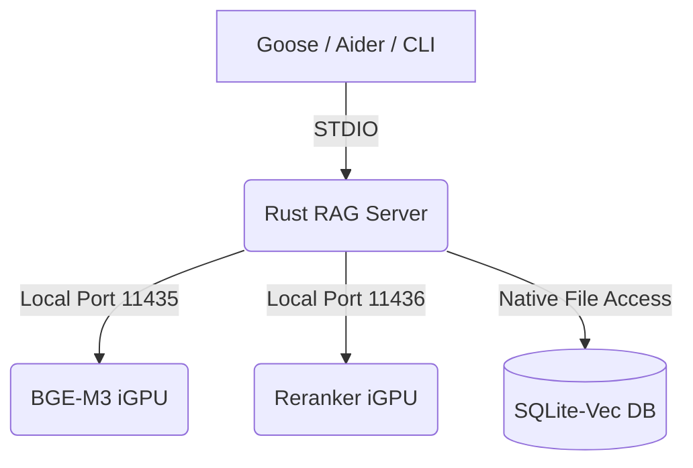

# 🚀 RAG MCP Server (Rust) — Native & Lean Edition

A high-performance, sovereign implementation of Retrieval-Augmented Generation (RAG) written in **Rust**. This server exposes advanced legal and code-centric search logic via the **Model Context Protocol (MCP)** over standard I/O.

Optimized for **Fedora 44** and hardware-accelerated via the **Vulkan API** on integrated Intel graphics (UMA), this server serves as the high-speed "memory" for autonomous agents like [Goose](https://github.com/block/goose) or [Aider](https://aider.chat).

---

## ✨ Key Milestones in v2.1 (The "Giants" Update)

- **Exact BGE-M3 Tokenization** – Integrated the Hugging Face `tokenizers` crate to count tokens precisely using the **XLM-RoBERTa** standard. No more "vague searches" based on simple word counts.
- **Vulkan-Driven Search** – Leverages `sqlite-vec` for high-density ANN (Approximate Nearest Neighbor) search, fully saturating the iGPU.
- **Smart Chunking for Professionals** – Supports large, token-aware chunks (e.g., 3000 tokens) with sliding overlaps to preserve complex legal dependencies and Rust logic structures (`impl` blocks).
- **Dual-Engine Architecture** – Purpose-built to communicate directly with dedicated backend pipelines:
  - **Port 11435**: BGE-M3 Multilingual Embeddings.
  - **Port 11436**: BGE-Reranker-v2 for 97% citation accuracy.
- **Consolidated Sovereignty** – All configuration, databases, and metadata are strictly local, stored at `~/.config/rag-server/`.

---

## 🏗 Architecture: The Zero-Proxy Stack

To eliminate latency and middle-layer overhead, the server communicates directly with local Vulkan-accelerated engines:



---

## 🔧 Installation & Compilation

### Prerequisites

- **Rust** 1.79+
- **sqlite-vec** library (`sudo dnf install sqlite-vec`)
- **BGE-M3 Tokenizer Metadata**:
  ```bash
  mkdir -p ~/.config/rag-server
  wget https://huggingface.co/BAAI/bge-m3/resolve/main/tokenizer.json -O ~/.config/rag-server/tokenizer.json
  ```

### Build the Binary

```bash
cd ~/.config/rag-server
cargo build --release
```

---

## ⚙️ Configuration

The server prioritizes environment variables but falls back to optimized defaults for a 16GB mobile workstation.

| Variable             | Default Value                          | Description                                |
| :------------------- | :------------------------------------- | :----------------------------------------- |
| `RAG_DB_PATH`        | `~/.config/rag-server/vectors.db`      | Path to the SQLite-vec database.           |
| `RAG_TOKENIZER_PATH` | `~/.config/rag-server/tokenizer.json`  | Exact BPE model for BGE-M3.                |
| `RAG_EMBED_URL`      | `http://localhost:11435/v1/embeddings` | Your Vulkan Embedding server.              |
| `RAG_RERANK_URL`     | `http://localhost:11436/rerank`        | Your Vulkan Reranker server.               |
| `RAG_CHUNK_SIZE`     | `1024` (Law) / `3000` (Code)           | Maximum tokens per chunk.                  |
| `RAG_CHUNK_OVERLAP`  | `150` (Law) / `400` (Code)             | Token overlap for context preservation.    |
| `RAG_TIMEOUT`        | `14400` (4 hours)                      | Prevents timeouts during massive indexing. |

---

## 🔌 Usage with Goose Agent

Update your `~/.config/goose/config.yaml` to replace the generic Python RAG extension with this optimized Rust binary:

```yaml
extensions:
  rag:
    enabled: true
    name: rag
    type: stdio
    cmd: /home/bfrost/.config/rag-server/target/release/rag-server
    timeout: 14400
```

---

## 🛠 MCP Tools

| Tool                | Description                                                            |
| :------------------ | :--------------------------------------------------------------------- |
| `create_collection` | Initializes a new Knowledge Base (e.g., `juridik` or `rust-src`).      |
| `ingest_file`       | Chunks, tokenizes, and indexes a file via the iGPU.                    |
| `list_collections`  | Lists all searchable libraries and document counts.                    |
| `query`             | Performs hybrid semantic search + Reranking for 97% citation accuracy. |
| `delete_documents`  | Removes specific documents or clears entire collections.               |

---

## 🏁 Performance Insights (The Rust Advantage)

Unlike interpreted Python implementations, this server handles **tokenization in-process** at C-speeds. By bypassing the "PCIe Dinosaur" through **Unified Memory Architecture**, indexing time for 700 project chunks was reduced from **45+ minutes (CPU)** to **~5 minutes (iGPU/Vulkan)**.

Through **QAT-UD** model support and **N-Gram speculation**, this stack achieves production-grade legal reasoning on standard "U-series" hardware with **0% data leakage**.

---

**Author:** [Bengt Frost](https://github.com/bengtfrost)\
**Philosophy:** Native & Lean | Unified Memory | Sovereign AI\
**License:** MIT
